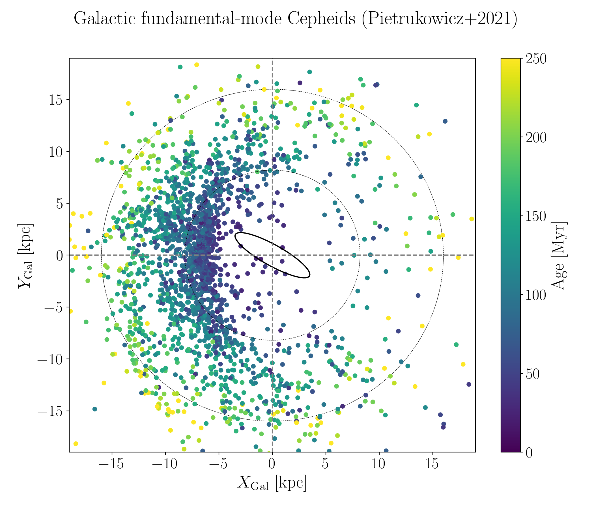

# Age distribution of Cepheids in the Milky Way
### Analyzing and comparing the observed population with models

Code reproducing the figures in [Anders, Padois, Vilanova et al. (2024)](https://arxiv.org/abs/2406.06228).

## Setup

Standard modules: numpy, scipy, astropy, pandas, matplotlib

## Notebooks

* cepheids_radial_distribution.ipynb - Reading and enhancing the carefully curated MW Cepheid compilation of Pietrukowicz+2021 (reproduces Figs. 1 and 5 in the paper)
* cepheids_vs_BGM.ipynb              - a comparison with the Besançon Galaxy Model simulation used in Mor+2019 (reproduces Fig. 2 in the paper)
* simulate_cepheids_BaSTI.ipynb      - simulation of a population of Galactic classical Cepheids from a number of simple assumptions + BaSTI models (reproduces Figs. 3 and 4 in the paper)

## python modules

* cepheid_utils.py - implementations of some useful formulae for Milky Way Cepheids
* open_basti.py    - reads BaSTI stellar models
* [abj2016.py](https://github.com/fjaellet/abj2016)       - computes simple Bayesian distances from parallaxes à la Astraatmadja & Bailer-Jones (2016) 
